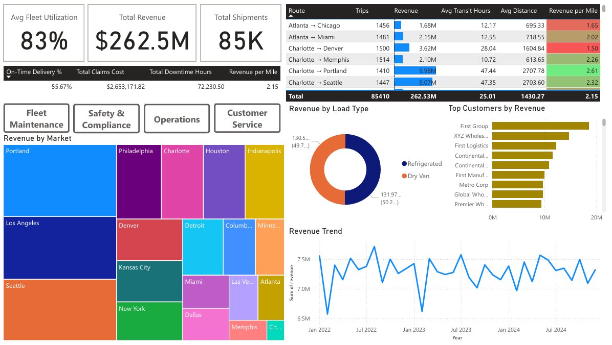

# Logistics Intelligence Platform

  

<em>Executive view of revenue, shipment volume, fleet utilization, customer value, and route performance.</em>

## Project Overview

This project presents an integrated business intelligence solution for STS8 Logistics, a fictional transportation company seeking better visibility into financial performance, fleet operations, maintenance, safety, and customer service.

The solution brings together operational data from multiple business functions within a relational model and converts it into role-specific Power BI dashboards. It was designed to help leaders move from fragmented reporting toward a centralized environment with consistent metrics and clearer operational insight.

## Business Problem

STS8 Logistics relies on data generated across customers, drivers, vehicles, routes, shipments, fuel purchases, maintenance activity, delivery events, and safety incidents. When these records are evaluated separately, leaders cannot easily identify relationships between revenue, operating efficiency, vehicle performance, service quality, and organizational risk.

The project addresses this challenge by creating a unified reporting structure that connects these operational areas and presents the information according to stakeholder needs.

## Solution

The completed solution includes:

- A multi-table logistics dataset representing core operational functions
- A relational data model connecting customers, loads, trips, routes, drivers, vehicles, maintenance, fuel, safety, and delivery activity
- Data validation and transformation within Power Query
- DAX measures for financial and operational performance
- Five interactive Power BI report pages designed for different stakeholder groups
- A supporting data-governance framework and implementation plan

## Dashboard Pages

| Dashboard | Primary focus |
|---|---|
| **Executive** | Revenue, shipment volume, fleet utilization, customer value, and route performance |
| **Operations Manager** | Trip volume, mileage, fuel efficiency, transit time, driver activity, and load mix |
| **Fleet Maintenance** | Maintenance cost, downtime, utilization, repair type, and vehicle performance |
| **Safety & Compliance** | Incident frequency, claims cost, preventability, fault, location, and trends |
| **Customer Service** | Delivery performance, active customers, booking activity, load type, and service geography |

## Data Model

The solution incorporates operational tables covering:

- Customers and facilities
- Drivers, trucks, and trailers
- Routes, loads, and trips
- Delivery events
- Fuel purchases
- Maintenance records
- Safety incidents
- Driver and fleet-utilization metrics

These tables were connected through shared operational identifiers to support analysis across business functions while maintaining consistent relationships and reporting logic.

## Tools and Methods

- Power BI
- Power Query
- DAX
- Relational data modeling
- Data validation
- KPI development
- Dashboard design
- Data governance
- Implementation planning

## Download the Project

- [View the Complete Project Report](./logistics-intelligence-platform-report.pdf)
- [Download the Interactive Power BI Report](./sts8_logistics.pbix)

> Power BI Desktop is required to open and interact with the `.pbix` report.
