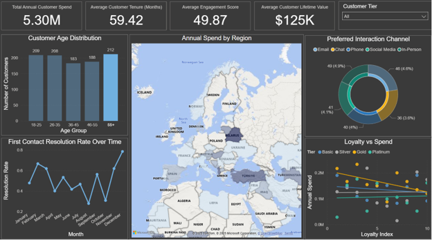

# Customer Behavior & Value Dashboard

  

<em>Interactive analysis of customer behavior, value, purchasing patterns, and performance across customer segments.</em>

---

## Project Overview

This project demonstrates how interactive business intelligence can help an organization better understand its customers. The Power BI dashboard organizes customer and transaction information into a visual reporting environment where users can explore behavior, compare customer segments, and identify patterns that may influence business performance.

The report was designed to make customer information easier to interpret without requiring users to examine individual records or static tables. KPI cards, filters, interactive visuals, and supporting tooltips allow decision-makers to move between an overall performance view and more focused customer-level analysis.

## Business Purpose

Organizations often collect substantial customer and transaction data without having a clear framework for turning it into useful insight. This dashboard addresses that challenge by presenting customer behavior and value in an accessible format that supports performance monitoring, customer segmentation, and more informed business decisions.

## Dashboard Features

- KPI cards that summarize key customer and business measures
- Customer segmentation for comparing behaviors and value
- Interactive slicers that allow users to refine the analysis
- Cross-filtering between visuals for deeper exploration
- Tooltips that provide additional context without overcrowding the report
- Visual comparisons that highlight differences across customer groups

## Analytical Approach

The project focuses on presenting customer information at multiple levels of detail. Summary measures establish overall performance, while interactive visuals allow users to investigate the customer groups and behaviors contributing to those results. The dashboard design emphasizes clarity, logical navigation, and the ability to answer follow-up questions through interaction.

## Skills Demonstrated

- Designing an interactive Power BI report
- Translating customer data into business-focused KPIs
- Building customer segments for comparative analysis
- Using slicers, cross-filtering, and tooltips
- Applying visual hierarchy and dashboard-design principles
- Communicating analytical findings to a business audience

## Project Files

- [View the Complete Project Report](./customer_behavior_and_value_dashboard_report.pdf)
- [Download the Interactive Power BI Report](./customer_behavior_and_value_dashboard.pbix)

> Power BI Desktop is required to open and interact with the `.pbix` report.

---

[Return to Business Intelligence & Visualization](../README.md)
