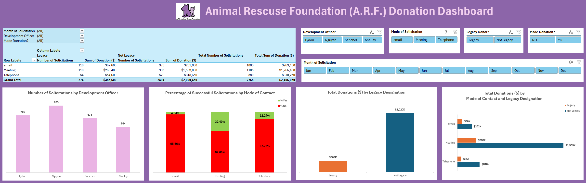

# Donor Campaign Performance Dashboard

  

<em>Campaign overview showing fundraising results, donor activity, solicitation performance, and giving patterns.</em>

## Project Overview

This project examines the performance of a nonprofit fundraising campaign using approximately 2,700 solicitation records. The Excel dashboard transforms detailed campaign data into a practical reporting tool that helps organizational leaders understand donation activity, compare fundraising channels, and evaluate campaign results.

## Business Context

Fundraising data can reveal which outreach strategies generate the strongest response, but individual solicitation records are difficult to interpret without a consolidated view. This project organizes campaign activity into meaningful performance measures so decision-makers can identify successful approaches and focus future fundraising efforts more effectively.

## Analytical Approach

The workbook uses Excel formulas, PivotTables, filters, and visualizations to summarize campaign performance from multiple perspectives. The analysis considers donation results, solicitation methods, legacy giving, and fundraiser performance to provide a more complete view of how the campaign generated contributions.

## Dashboard Insights

The dashboard allows users to explore:

- Overall fundraising and donation performance
- Results across different solicitation channels
- Legacy-giving activity and contribution patterns
- Individual fundraiser or officer performance
- Campaign trends and areas for further investigation

## Skills Demonstrated

- Excel-based data analysis
- PivotTable development
- Dashboard design
- Data filtering and segmentation
- Performance measurement
- Visual communication
- Fundraising and campaign analytics

## Project File

The complete interactive Excel workbook will be available below.

- [Download the Donor Campaign Performance Dashboard](./donor_campaign_performance_dashboard.xlsx?raw=1)

> Microsoft Excel is recommended for viewing and interacting with the complete dashboard.
