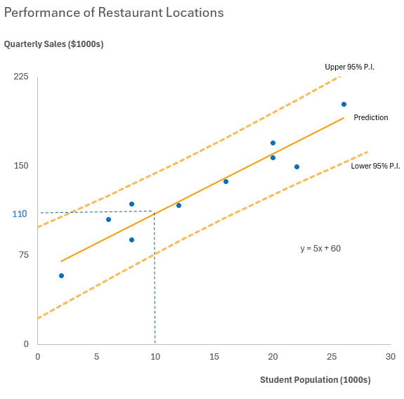

# Excel Analytics & Visualization Studies

  

<em>Selected Excel analysis demonstrating comparative, categorical, and trend-focused data visualization.</em>

---

## Project Overview

This collection presents selected Excel studies developed to explore how different visualization methods influence the interpretation of data. The work covers several business and public-interest contexts, ranging from organizational and market comparisons to website rankings, trading activity, salary information, and larger operational datasets.

Rather than treating charts as decoration, these studies focus on matching each visualization to the structure of the data and the question being examined. The collection demonstrates how Excel can be used to organize raw information, summarize results, compare categories, identify patterns, and communicate findings clearly.

## Selected Studies

### Comparative Visualization Studies

This workbook examines categorical, geographic, and comparative information through topics including Fortune 500 headquarters, turfgrass selection, professional sports performance, and pet-food comparisons. The exercises demonstrate how chart selection affects the clarity of comparisons between groups.

[Download the Comparative Visualization Workbook](./comparative_visualization_studies.xlsx)

### Trend and Web Visualization Studies

This workbook explores ranked website data, sports-related information, restaurant franchise comparisons, and day-trading activity. The studies emphasize trend recognition and the presentation of data that changes across observations or reporting periods.

[Download the Trend and Web Visualization Workbook](./trend_and_web_visualization_studies.xlsx)

### Large-Dataset Excel Analysis

This workbook applies Excel analysis and visualization techniques to several datasets, including one containing nearly 20,000 records. It demonstrates how a larger source table can be transformed into focused analytical views that make patterns and comparisons easier to interpret.

[Download the Large-Dataset Analysis Workbook](./large_dataset_excel_analysis.xlsx)

## Skills Demonstrated

- Preparing and organizing data in Excel
- Analyzing larger tabular datasets
- Selecting charts based on analytical purpose
- Comparing categorical and quantitative information
- Presenting trends and relationships visually
- Developing clear, audience-focused worksheet layouts
- Using Excel tables, summaries, and supporting calculations

---

[Return to Previous Page](../)

