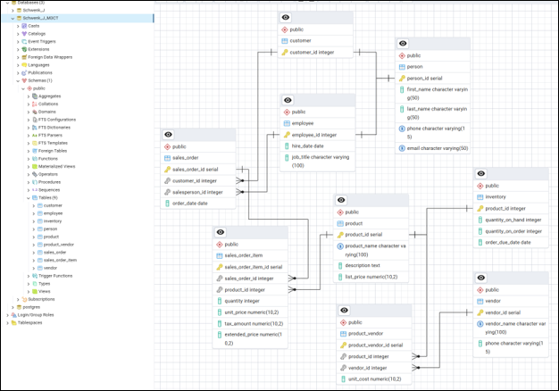

# Curiosity Shop Database Redesign

  

<em>Redesigned relational model supporting sales, inventory, vendor sourcing, and overlapping customer and employee roles.</em>

---

## Project Overview

The Curiosity Shop’s original database could record sales but was not flexible enough to support its evolving operational needs. The design created redundant personal information, provided limited inventory visibility, and could not adequately represent products supplied by multiple vendors.

This project evaluates those limitations and redesigns the entity-relationship model to improve data organization, reduce duplication, and support more accurate operational reporting.

## Design Improvements

The redesigned model introduces several structural changes:

- A `Person` supertype consolidates attributes shared by customers and employees.
- Customer and employee subtypes represent their distinct business roles.
- A dedicated inventory structure tracks quantities available, quantities on order, and expected delivery dates.
- A many-to-many relationship allows products to be sourced from multiple vendors.
- Minimum and maximum cardinalities define how entities may participate in each relationship.
- Sales information is separated into appropriate entities to support transactions containing multiple products.

## Business Value

The revised design gives the Curiosity Shop a more scalable foundation for managing sales, inventory, customers, employees, products, and vendors. It also improves the organization’s ability to monitor stock levels, compare sourcing options, and maintain consistent information when one person has more than one relationship with the business.

## Skills Demonstrated

- Evaluating weaknesses in an existing database
- Entity-relationship diagram redesign
- Supertype and subtype modeling
- Redundancy reduction
- Inventory data modeling
- Many-to-many relationship design
- Cardinality and participation rules
- Translating operational needs into database structures

## Project File

- [View the Complete Database Redesign Report](./curiosity_shop_database_redesign_report.pdf)

---

[Return to Database Design & SQL](../README.md)
