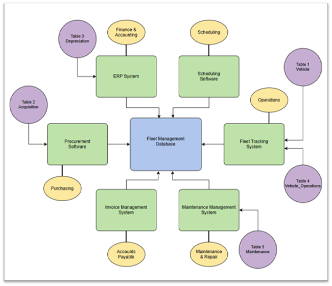

# Fleet Management System Database Proposal

  

<em>Proposed system connecting departmental source applications, relational database tables, and fleet reporting.</em>

---

## Project Overview

This project proposes a relational database for managing an organization’s vehicle fleet. The system is designed to consolidate vehicle, acquisition, depreciation, operating, and maintenance information so the organization can produce accurate asset records and better understand the full cost of its fleet.

## Database Design

The vehicle table forms the center of the relational model, with the Vehicle Identification Number serving as a stable identifier across related records. Supporting tables organize:

- Vehicle specifications and identifying information
- Acquisition dates and purchase costs
- Depreciation methods and current asset values
- Fuel, insurance, registration, and other operating expenses
- Maintenance activity, repair history, and service costs

This structure reduces duplication while allowing financial and operational information to be connected at the individual-vehicle level.

## Organizational Integration

The proposal identifies the departments responsible for creating and maintaining transactional data. Purchasing manages acquisition records, Finance and Accounting maintains depreciation information, Operations tracks vehicle usage and operating costs, and Maintenance records service and repair activity.

A system diagram connects these departmental applications to the central database and shows how SQL-based reporting could provide a consolidated view of fleet assets, costs, and performance.

## Data Management Considerations

The proposal applies ACID principles to support reliable database transactions and recommends formal database administration to maintain security, performance, availability, and data quality.

Together, these controls establish accountability for fleet information and support more dependable operational and financial reporting.

## Skills Demonstrated

- Relational database planning
- Primary and foreign key design
- Cross-functional data integration
- System and data-flow diagramming
- Transactional data ownership
- ACID and data-integrity principles
- Database administration planning
- Business-focused reporting architecture

## Project File

- [View the Complete Fleet Management Database Proposal](./fleet_management_database_proposal.pdf)

---

[Return to Previous Page](../)

