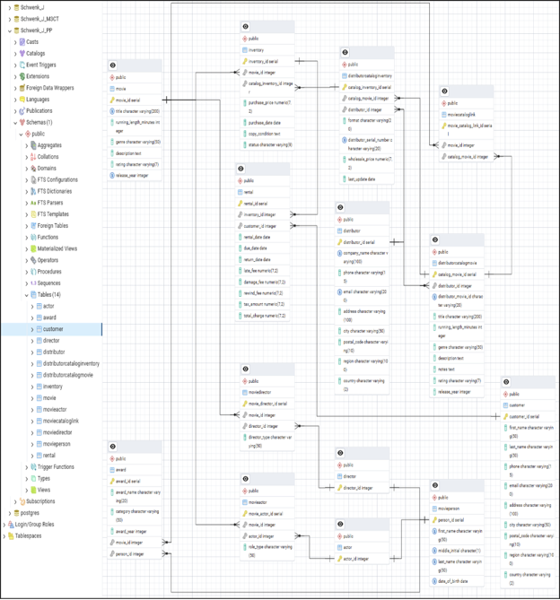

# Johnson Video Relational Database System

  

<em>Relational model connecting customers, rentals, movie inventory, titles, distributors, performers, and purchasing activity.</em>

---

## Project Overview

Johnson Video is a fictional video-rental business that relies on paper invoices and disconnected forms to manage customers, purchasing, inventory, and rentals. This project replaces that fragmented process with a PostgreSQL database designed to improve record accuracy and make operational information easier to retrieve.

The project follows the database-development lifecycle from requirements and business rules through entity-relationship modeling, table creation, data population, and SQL analysis.

## Database Solution

The relational model separates movie titles from individual rentable copies while connecting inventory to customers, rentals, performers, distributors, and purchasing activity. Primary keys, foreign keys, bridge tables, required fields, and value constraints are used to preserve relationships and improve data integrity.

Business rules address rental availability, customer accounts, due dates, late fees, media formats, and accepted rating values. The project also distinguishes rules enforced directly by PostgreSQL from policies that would require application or employee oversight.

## SQL Analysis

Queries were developed to support decisions across the business, including:

* Comparing distributor selection and purchasing costs
* Identifying missing titles and limited inventory
* Monitoring overdue rentals and associated fees
* Finding high-activity customers and geographic concentrations
* Evaluating performer representation within the catalog

These questions demonstrate how relational design and multi-table SQL queries can turn operational records into useful information for purchasing, inventory management, customer service, and marketing.

## Skills Demonstrated

* Requirements and business-rule development
* Entity-relationship modeling
* Relational database design
* PostgreSQL table creation and data population
* Primary and foreign key implementation
* Data-integrity constraints
* Multi-table SQL querying
* Business-focused database analysis

## Project File

* [View the Complete Database Project Report](./johnson_video_database_report.pdf)
* [View Metadata Workbook](./jvmetadata.xlsx)

---

[Return to Previous Page](../)

