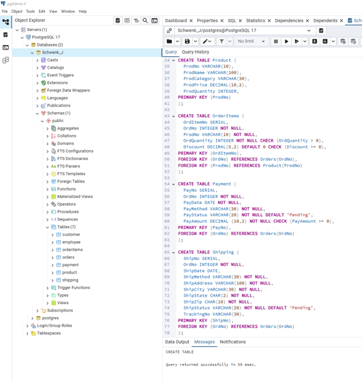

# Lift Line Looks E-commerce Database

  

<em>PostgreSQL table structure supporting customers, products, orders, payments, shipping, and inventory.</em>

---

## Project Overview

Lift Line Looks is a fictional Vail-based retailer expanding from a physical storefront into online sales. This project develops the relational database foundation needed to support its e-commerce operations and organize information that would otherwise be distributed across separate business processes.

## Database Solution

The PostgreSQL design connects customers, employees, products, orders, payments, and shipping activity. An `OrderItems` bridge table resolves the many-to-many relationship between orders and products, allowing one order to contain multiple products while each product can appear across multiple orders.

Primary and foreign keys maintain the relationships between entities, while the table structure supports order processing, inventory management, fulfillment, and customer-service reporting.

## Business Value

The database provides a structured foundation for questions such as:

- Which products and categories generate the most sales?
- Which customers place repeat or high-value orders?
- What is the status of individual orders and shipments?
- Which employees are associated with order activity?
- How do payment and fulfillment records connect to each transaction?

This design demonstrates how a relational database can support both daily e-commerce operations and future business reporting.

## Skills Demonstrated

- Translating e-commerce requirements into database entities
- PostgreSQL table creation
- Primary and foreign key implementation
- One-to-many and many-to-many relationships
- Bridge-table design
- Relational data modeling
- Business-focused database planning

## Project File

- [View the Complete Database Design Report](./lift_line_looks_ecommerce_database_report.pdf)

---

[Return to Database Design & SQL](../README.md)
