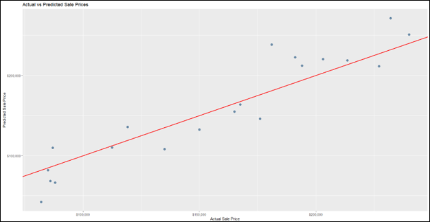

# Ames Housing Price Prediction

  

<em>Comparison of actual and predicted home prices, with the red reference line representing perfect prediction.</em>

---

## Project Overview

This project uses R to examine housing prices in Ames, Iowa and develop a multiple linear regression model for predicting sale price. Separate training and testing datasets allow the model to be developed on historical observations and evaluated against unseen data.

## Analytical Approach

The analysis includes:

- Data import and structure validation
- Descriptive statistics for home sale prices
- Histogram-bin selection using the Freedman–Diaconis rule
- Distribution comparisons across training and testing data
- Multiple linear regression using housing characteristics
- Missing-value handling in the testing dataset
- Actual-versus-predicted comparisons
- Model evaluation using MAE and MAPE

## Model Results

The training model achieved an R-squared value of approximately `0.847` and an adjusted R-squared of `0.842`, indicating that the included housing characteristics explained a substantial portion of the variation in sale prices.

When evaluated against testing observations, the model produced:

- **Mean Absolute Error:** approximately `$20,270`
- **Mean Absolute Percentage Error:** approximately `14.6%`

The results show that the model captures the overall direction of housing prices while retaining some prediction error, particularly among higher-value properties.

## Skills Demonstrated

- R programming
- Data preparation and validation
- Exploratory data analysis
- Multiple linear regression
- Training and testing workflows
- Prediction-error measurement
- Model-performance interpretation
- Data visualization with `ggplot2`

## Project Files

- [View the Complete Housing Analysis](./ames_housing_price_prediction_report.pdf)
- [View the R Source Code](./ames_housing_price_prediction.R)

> The course-provided housing datasets are not redistributed in this repository.

---

[Return to Previous Page](../)

