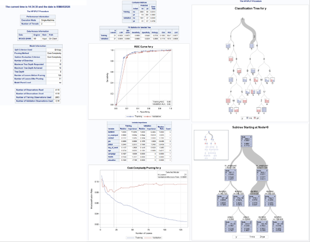

# Bank Marketing Segmentation & Subscription Prediction

  

<em>Decision-tree classification results used to predict customer subscription to a term deposit.</em>

---

## Project Overview

This project analyzes a bank marketing dataset containing more than 4,000 customer and campaign observations. The objective was to identify meaningful customer segments and predict whether a client would subscribe to a term deposit.

The analysis considers data quality, unusual observations, class imbalance, customer segmentation, model performance, and the practical interpretation of predictive results.

## Analytical Approach

The project follows a structured data-mining workflow:

- Summary analysis of numeric and categorical variables
- Z-score anomaly detection and evaluation of extreme observations
- Correlation analysis among quantitative variables
- Comparison of K-means solutions ranging from two to five clusters
- Customer segmentation using a four-cluster model
- Decision-tree classification with training and validation data
- Cost-complexity pruning and model-performance evaluation

The target variable was highly imbalanced, with approximately 89% of customers not subscribing. Because accuracy alone could be misleading, the analysis also considered classification behavior and performance for the less-common subscription outcome.

## Key Results

The four-cluster solution provided meaningful customer groupings without producing excessively small segments. Call duration, previous campaign activity, and contact frequency contributed to differences between the clusters.

The decision tree identified call duration as the strongest predictor of subscription. Contact type, employment conditions, occupation, and previous campaign activity also contributed to the classification.

The model achieved an AUC of approximately `0.90` on the training data and `0.86` on the validation data, with a validation misclassification rate of approximately `8%`.

## Skills Demonstrated

- Exploratory data analysis
- Z-score anomaly detection
- Class-imbalance evaluation
- K-means clustering
- Decision-tree classification
- Training and validation partitions
- Model-performance evaluation
- Translating predictive results into business insight

## Project File

- [View the Complete Predictive Analysis Report](./bank_marketing_predictive_analysis_report.pdf)

---

[Return to Statistical & Predictive Analytics](../README.md)
