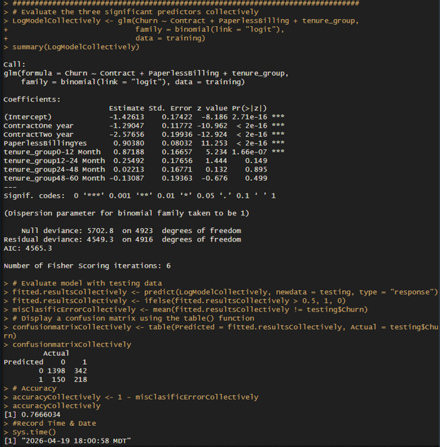

# Customer Churn Classification in R

  

<em>Churn-classification results using contract type, paperless billing, and customer tenure.</em>

---

## Project Overview

This project uses R and logistic regression to predict customer churn within a telecommunications dataset containing 7,032 observations. A full model was compared with individual and reduced-predictor models to evaluate how variable selection affects classification performance.

## Analytical Approach

The dataset was divided into 70% training data and 30% testing data. The analysis then compared:

- A full logistic regression model using all available predictors
- Individual models using contract type, paperless billing, and tenure group
- A reduced model combining the three most significant predictors
- Confusion matrices and classification accuracy across the models

## Key Findings

The full model achieved approximately `79.9%` accuracy on the testing data. Contract type, paperless billing, and tenure group emerged as the strongest predictors of customer churn.

When evaluated individually, the selected predictors tended to classify customers into the majority non-churn category. Combining them produced a more balanced classification pattern, demonstrating why model performance should be evaluated beyond overall accuracy—particularly when the outcome classes are unevenly distributed.

## Skills Demonstrated

- R programming
- Training and testing partitions
- Binary logistic regression
- Predictor selection
- Confusion-matrix interpretation
- Classification accuracy
- Model comparison
- Class-imbalance awareness

## Project Files

- [View the Complete Churn Classification Report](./customer_churn_classification_report.pdf)
- [View the R Source Code](./customer_churn_classification.R)

> The course-provided telecommunications dataset is not redistributed in this repository.

---

[Return to Statistical & Predictive Analytics](../README.md)
