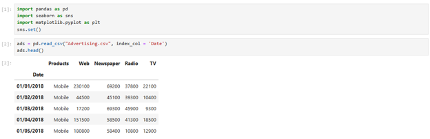
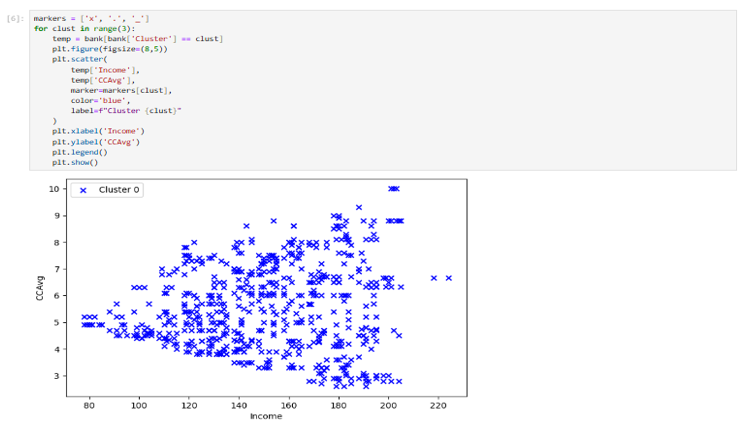

# Python Marketing Analytics Studies

## Project Overview

This collection presents two Python studies examining how customer and campaign data can support marketing decisions. The first uses exploratory analysis to compare advertising performance across product categories and media channels. The second applies K-means clustering to segment banking customers based on their financial behavior.

Together, the studies demonstrate progression from data inspection and grouped analysis to feature scaling, unsupervised learning, cluster profiling, and business interpretation.

---

## Advertising Channel Analysis

  

This study analyzes 200 advertising observations across web, television, newspaper, and radio channels. Python and pandas were used to inspect the dataset, calculate descriptive statistics, count product categories, aggregate viewership, and create comparative bar charts.

The results showed that web advertising generated the greatest overall viewership, while mobile products received the strongest exposure. Laptop products consistently produced the lowest viewership, indicating an opportunity to reconsider their channel allocation or campaign strategy.

**Methods:** Data inspection • Descriptive statistics • `groupby()` aggregation • Bar charts

[View the Advertising Channel Analysis](./advertising_channel_analysis.pdf)

---

## Bank Customer Segmentation

  

This study applies K-means clustering to 5,000 banking customers using income and average credit-card spending. The variables were standardized before modeling so differences in their measurement scales would not distort the clustering results.

Three customer segments were identified. The highest-income and highest-spending cluster also had the greatest personal-loan participation at approximately 41%. A middle segment showed more moderate loan adoption, while the lowest-income and lowest-spending group had no existing personal loans.

The resulting profiles provide a basis for concentrating loan marketing on customers with stronger financial capacity and demonstrated borrowing behavior.

**Methods:** Feature scaling • K-means clustering • Cluster profiling • Customer segmentation

[View the Bank Customer Segmentation Analysis](./bank_customer_segmentation.pdf)

---

## Skills Demonstrated

- Python-based data analysis
- pandas DataFrame operations
- Descriptive and grouped analysis
- Feature standardization with `StandardScaler`
- K-means clustering with scikit-learn
- Cluster visualization and profiling
- Translating analytical results into marketing recommendations

> The original Python source files were not retained, but the code and corresponding outputs are preserved in both project reports.

---

[Return to Previous Page](../)

