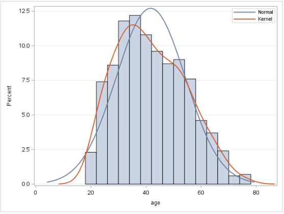

# Telco Extra Customer Churn & Income Modeling

  

<em>Logistic regression results identifying customer characteristics associated with telecommunications churn.</em>

---

## Project Overview

This project uses SAS to examine customer behavior within a fictional telecommunications company. The analysis evaluates which customer characteristics are associated with churn and whether internal demographic and service information can help explain customer income.

Two statistical models were developed: a binary logistic regression model for customer churn and a multiple linear regression model for income.

## Analytical Approach

The project includes:

- Descriptive analysis of customer characteristics
- Distribution and outlier evaluation
- Binary logistic regression for churn
- Odds-ratio and significance interpretation
- Multiple linear regression for customer income
- ANOVA and model-fit evaluation
- Assessment of model limitations and business usefulness

## Key Findings

Of the 1,000 customers analyzed, approximately `27.4%` had churned. The logistic regression identified age, education level, and years at the current address as statistically significant predictors. Older customers and those with greater residential stability were generally less likely to churn.

The income model was statistically significant overall, with age and education showing the strongest relationships with income. However, its adjusted R-squared value was approximately `0.140`, indicating that much of the variation in customer income was not explained by the available variables.

These results demonstrate the importance of evaluating both statistical significance and practical explanatory power before using a model for business decisions.

## Skills Demonstrated

- Descriptive statistical analysis
- Binary logistic regression
- Multiple linear regression
- Hypothesis evaluation
- Odds-ratio interpretation
- ANOVA and model-fit analysis
- Responsible interpretation of model limitations
- Translating statistical results into customer-retention insight

## Project File

- [View the Complete Customer Modeling Report](./telco_customer_modeling_report.pdf)

> SAS code and corresponding outputs are documented in the complete project report.

---

[Return to Statistical & Predictive Analytics](../README.md)
