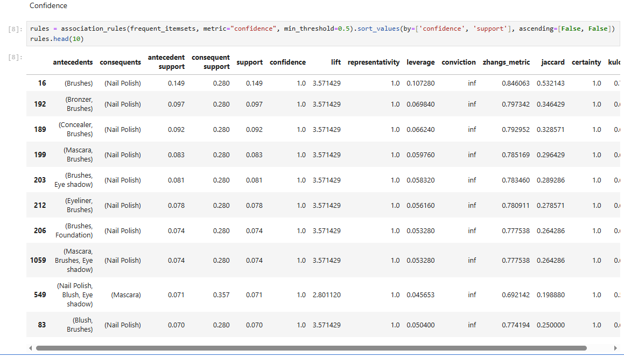
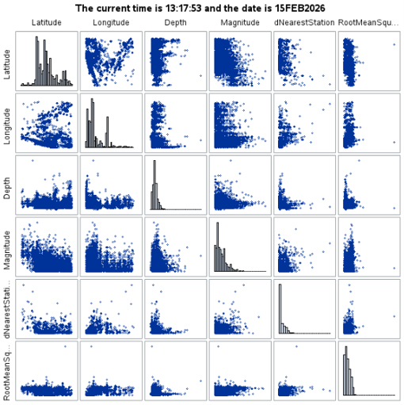

# Unsupervised Learning Studies

## Project Overview

This collection presents two unsupervised-learning studies completed with Python and SAS. The first uses association-rule mining to identify relationships between products purchased together. The second uses K-means clustering to group earthquake observations according to geographic, event, and monitoring characteristics.

Together, the studies demonstrate how different analytical tools and unsupervised methods can reveal meaningful structures within complex datasets.

---

## Market-Basket Association Rules

  

This study uses Python to analyze cosmetics transactions from a large drugstore chain and identify products frequently purchased together. Association rules were evaluated using support, confidence, and lift to distinguish common purchasing behavior from relationships occurring more often than expected by chance.

The results identified several connections between cosmetic products and application tools. These patterns could support product placement, cross-selling, recommendation systems, and promotional bundles.

One notable rule connected nail polish and bronzer purchases with brushes, producing approximately `9.7%` support, `77.6%` confidence, and a lift of `5.21`.

**Methods:** Python • Association Rules • Support • Confidence • Lift

[View the Market-Basket Association Analysis](./market_basket_association_rules.pdf)

---

## Earthquake Clustering Analysis

  

This study uses SAS and `PROC FASTCLUS` to apply K-means clustering to more than 15,000 earthquake observations. Location, depth, magnitude, distance to the nearest monitoring station, and root-mean-square timing error were examined to identify observations with similar characteristics.

Variables were standardized before modeling, and multiple cluster solutions were compared based on separation, model fit, stability, and interpretability. Separate analyses accounted for missing monitoring-related values while preserving the larger set of complete earthquake records.

The resulting clusters demonstrate how unsupervised learning can identify geographic concentrations and meaningful differences in earthquake and monitoring characteristics.

**Methods:** SAS • PROC FASTCLUS • Standardization • K-means Clustering

[View the Earthquake Clustering Analysis](./earthquake_clustering_analysis.pdf)

---

## Skills Demonstrated

- Python-based association-rule mining
- SAS analysis with `PROC FASTCLUS`
- Support, confidence, and lift evaluation
- Feature standardization
- K-means clustering
- Cluster-model comparison
- Pattern and cluster-profile interpretation
- Translating analytical results into practical recommendations

> Python and SAS code with corresponding outputs are documented in the complete project reports.

---

[Return to Statistical & Predictive Analytics](../README.md)
