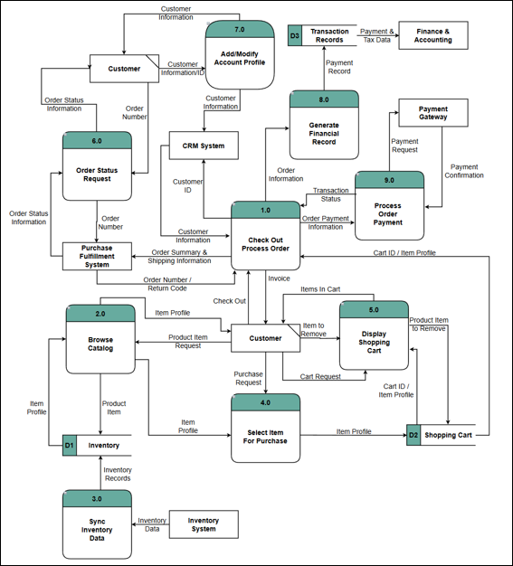

# Direct-to-Consumer Ordering System Strategy

  

<em>Data-flow model connecting customer activity with inventory, shopping cart, CRM, payment, fulfillment, and financial systems.</em>

---

## Project Overview

This project develops a systems strategy for an organization transitioning to a direct-to-consumer business model. The proposed customer-ordering system would allow consumers to browse products, manage shopping carts, create accounts, select shipping options, and complete payments through a secure online environment.

The analysis connects the organization’s growth strategy with the requirements, processes, costs, and implementation considerations needed to support the new operating model.

## Systems Analysis

The project evaluates how customers, internal teams, and supporting technologies interact throughout the ordering process. Business needs are translated into system requirements and models that define how information should move from product selection through payment and fulfillment.

The proposed system considers:

- Customer and account management
- Product browsing and cart functionality
- Order creation and payment processing
- Shipping selection and fulfillment
- Data accuracy and system security
- Internal operational responsibilities
- Scalability as transaction volume grows

## Feasibility and Implementation

An economic feasibility analysis evaluates the expected costs and benefits of the proposed system. The project also considers implementation risks, organizational readiness, training needs, and the operational changes required to support direct customer sales.

Together, these elements help determine whether the proposed solution is technically practical, financially supportable, and aligned with the organization’s long-term strategy.

## Skills Demonstrated

- Business and systems analysis
- Requirements development
- Process and system modeling
- Stakeholder identification
- Economic feasibility analysis
- Risk and implementation planning
- Translating business strategy into system capabilities
- Communicating recommendations to decision-makers

## Project Files

- [View the Complete Systems Strategy Report](./direct_to_consumer_system_strategy_report.pdf)
- [Download the Economic Feasibility Analysis](./economic_feasibility_analysis.xlsx?raw=1)

---

[Return to Previous Page](../)

