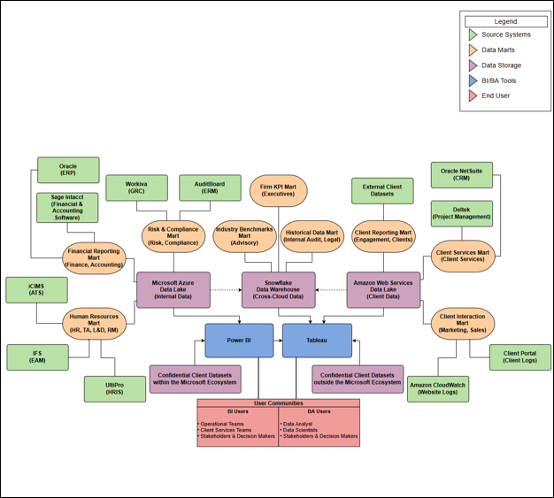

# Enterprise BI & Cloud Data Strategy

  

<em>Proposed architecture connecting cloud data platforms, enterprise applications, semantic models, and business intelligence tools.</em>

---

## Project Overview

This project develops an enterprise business intelligence strategy for a professional services organization whose reporting data is distributed across multiple business applications and cloud platforms. Limited interoperability makes combined reporting difficult and creates barriers to consistent, organization-wide analysis.

The proposal establishes a scalable approach for connecting enterprise systems, centralizing information, and delivering accessible reporting through complementary business intelligence tools.

## Proposed Strategy

The proposed environment brings together data stored across Microsoft Azure, Amazon Web Services, and Snowflake. Data from enterprise applications would be integrated into centralized cloud storage and organized for downstream reporting.

Power BI supports reporting within the Microsoft ecosystem, while Tableau expands access to systems and users outside that environment. Shared data structures and semantic models help maintain consistent definitions as information moves between platforms and reporting tools.

## Governance and Implementation

Technology integration alone does not guarantee dependable reporting. The strategy also considers:

- Consistent definitions and reporting standards
- Data quality across connected systems
- Access controls and information security
- Ownership of shared organizational data
- Scalable integration between cloud platforms
- User adoption, training, and implementation planning

These elements help ensure that the reporting environment remains trustworthy and usable as business needs evolve.

## Business Value

The proposed strategy reduces fragmented reporting and gives decision-makers a more complete view of organizational performance. A connected data environment can improve collaboration, reduce manual reconciliation, and allow teams to spend more time interpreting information instead of gathering it from disconnected systems.

## Skills Demonstrated

- Enterprise BI strategy
- Cloud data architecture
- Cross-platform systems integration
- Semantic-model planning
- Data-governance considerations
- Reporting-tool evaluation
- Technology implementation planning
- Alignment of technical solutions with business needs

## Project File

- [View the Complete Enterprise BI Strategy](./enterprise_bi_cloud_data_strategy_report.pdf)

> This academic project presents a conceptual technology strategy. No confidential organizational data is included.

---

[Return to Previous Page](../)

